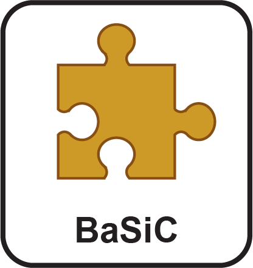
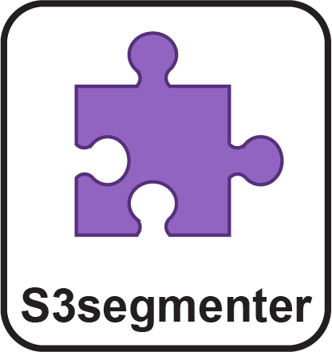
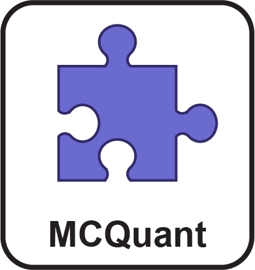

{: .no_toc }

  

    Table of contents
  

  {: .text-delta }
1. TOC
{:toc}

# Phase 3: Processing and analyzing images with MCMICRO

Multiplexed imaging results in a potentially unwieldy volume of data. Whole-slide sample areas are generally quite large, so whole slides are imaged by dividing a large specimen into a grid of tiles – often 100-1,000 tiles are needed per slide.  Together, this results in highly multiplexed, biologically rich, image sets that encompass many sample positions and many proteins. Each tile is a multi-dimensional TIFF that encompasses the multiple channels of data. After multiple imaging cycles the full data set is massive –up to 50,000 x 50,000 pixels x 100 channels per tile or ~500 GB of data per slide – too large to be processed by conventional image processing methods. 

{: .text-center }
_**This is where MCMICRO comes in.**_ 

MCMICRO provides a modular, customizable pipeline that allows users to process whole slide microscopy data into cohesive images that can be easily visualized and quantified as single cell data.

Walk through the process of turning image tiles into single-cell segmented mosaic image with our [pipeline visual guide]({{ site.baseurl }}/datasets/pipeline-visual-guide.html){:target="_blank"} (created with [Minerva](./mcmicro.html#visualization)).

 

{: .text-center }
{: .fs-9 }
{: .fw-500}
{: .text-grey-dk-100}
## The MCMICRO modules

	

<!-- end grid -->

	

	

	

<!-- end grid -->

## Image tiles to whole-slide mosaic images
Before performing analysis, the many image tiles must be combined into a single mosaic image where all tiles and channels can be viewed simultaneously. We do this with: i) illumination correction through BaSIC, ii) alignment and stitching by ASHLAR, and iii) image quality control using human-in-the-loop methods.

**BaSiC**  
Collecting multiplexed images is time consuming – imaging multiple whole slide samples can sometimes span several days. Microscope illumination is rarely perfectly stable over these long periods of time, so individual tile illumination is generally not perfectly uniform. We correct for these issues with a process known as _flat fielding_ using the BaSiC [(Peng et al., 2017)](https://doi.org/10.1038/ncomms14836){:target="_blank"} software package (developed elsewhere). We are currently working to more tightly link BaSIC to the next module, ASHLAR, to further improve illumination evenness.

**ASHLAR**  
The tiles must then be combined into a seamlessly aligned mosaic image in a process known as _stitching._ We developed the [ASHLAR](https://github.com/labsyspharm/ashlar){:target="_blank"} software package to generate highly accurate mosaic images for whole-slide imaging [(Muhlich et al., 2021)](https://doi.org/10.1101/2021.04.20.440625){:target="_blank"}. Visit the [ASHLAR website](https://labsyspharm.github.io/ashlar){:target="_blank"} to learn more about how ASHLAR works, and how to implement ASHLAR.

**Coreograph**  
[Coreograph]({{ site.baseurl }}/modules/coreograph.html) uses a deep learning model UNet [(Ronneberger et al., 2015)](https://arxiv.org/abs/1505.04597){:target="_blank"} to identify complete/incomplete tissue cores on a tissue microarray. Coreograph exports these tissue core images individually for faster downstream image processing [(Schapiro et al., 2021)](https://doi.org/10.1038/s41592-021-01308-y){:target="_blank"}. 

## Mosaic images to single-cell data
Extracting single-cell level data from highly multiplexed image data allows for clinically useful biological data at a depth that was not previously possible. To do this, images must first be segmented into single cells, then interesting features can be extracted into a descriptive cell features table. 

### Segmentation
Image processing is necessary to extract quantitative data from images. Although machine learning directly on images shows promise, most high-plex tissue imaging studies require the image to be 'segmented' into single cells before extracting single-cell data on a per-cell or per organelle basis. There are a number of solutions for segmentation that can be used with MCMICRO. We describe two, UnMICST [(Yapp et al., 2021)](https://doi.org/10.1101/2021.04.02.438285){:target="_blank"}, a method based on pixel probability maps, and S3segmenter [(Saka et al., 2019)](https://doi.org/10.1038/s41587-019-0207-y){:target="_blank"}, a watershed method.

**UnMICST**  
UnMICST is one example of a method that segments images using pixel probability maps. UnMICST generates probability maps where the intensity at each pixel defines how confidently that pixel has been classified to either a nucleus or background of the image. UnMICST then uses these probability maps to generate bounding boxes with binary masks that can be used to segment the image into single cells [(Yapp et al., 2021)](https://doi.org/10.1101/2021.04.02.438285){:target="_blank"}. Visit the [UnMICST website](https://labsyspharm.github.io/UnMICST-info/){:target="_blank"} to learn more!

**S3segmenter**28   
[S3segmenter](https://github.com/HMS-IDAC/S3segmenter){:target="_blank"} provides one example of a watershed based approach to segmentation that uses a Matlab-based set of functions that generates single-cell (nuclei and cytoplasm) masks. 

### Quantification
   
**MCQuant**   
[MCQuant](https://github.com/labsyspharm/quantification){:target="_blank"} takes in a multichannel image and segmentation mask and extracts single-cell data. This generates a _Cell Feature Table_ – analogous to a count table in RNA sequencing – that records the positions of individual cells and the associated features such as marker intensity, morphology, and quality control attributes. The Cell Feature Table is used for all subsequent analysis and is compatible with many tools developed for visualization of single cell sequencing data, like cellxgene [(Megill et al., 2021)](https://doi.org/10.1101/2021.04.05.438318){:target="_blank"}. It's important to note that a single marker in an image can be processed to generate a large number of distinct descriptive features beyond marker intensity (e.g. shape, granularity, localization within the cell, etc.).

{: .text-center }
*Additional capabilities for MCQuant are in active development - check the [GitHub release notes](https://github.com/labsyspharm/quantification/releases){:target="_blank"} for the latest updates related to MCQuant.* 

### Quality control

In practice, all tissue images contain technical artifacts that can disrupt image analysis. Artifacts can include sectioning artifacts (areas where the knife compresses or tears the specimen), embedded foreign objects (dust, hair), regions of fat or necrotic tissue that cannot easily be analyzed. Foreign objects are often the brightest pixels in an image and become outliers when high-dimensional data are clustered. Humans are remarkably good at looking past these artifacts to identify biologically meaningful patterns in biological data, but artifacts complicate computational methods of single-cell data analysis. 

**CyLinter**  
We recently developed [CyLinter](https://labsyspharm.github.io/cylinter/){:target="_blank"}, a human-in-the-loop interactive quality control [software](https://github.com/labsyspharm/cylinter){:target="_blank"} for identifying and removing cells corrupted by microscopy artifacts in multiplexed tissue images. The program takes single-cell feature tables generated by the MCMICRO image processing pipeline as input and returns a set of de-noised feature tables for use in downstream analyses. 

### Analysis
**SCIMAP**
Scimap is a scalable toolkit for analyzing spatial molecular data. SCIMAP takes in spatial data mapped to X-Y coordinates and supports preprocessing, phenotyping, visualization, clustering, spatial analysis and differential spatial testing [(Schapiro et al., 2021)](https://doi.org/10.1038/s41592-021-01308-y){:target="_blank"}. Visit the [SCIMAP website](https://scimap.xyz/){:target="_blank"} for more detailed information.

### Visualization

**Minerva**24  
Minerva is a suite of software tools for tissue atlases and digital pathology that enables interactive viewing and sharing of large image data [(Rashid et al., 2021)](https://doi.org/10.1038/s41551-021-00789-8){:target="_blank"}. Currently, we have released **Minerva Author**, a tool that lets you easily create and annotate images, and **Minerva Story**, a narrative image viewer for web hosting. Additional tools are in active development - go to the [Minerva wiki](https://github.com/labsyspharm/minerva-story/wiki){:target="_blank"} for the most up-to-date information about the Minerva suite. 

{: .text-center }
**\*\*Missing something?? --  [Suggest a module](./modules/#suggest-a-module) for us to develop in the future!\*\***

## Training data
Quality machine learning algorithms can only be generated from quality training data. Currently the field lacks sufficient freely-available data with ground truth labeling (such as pathologist-annotated images). Past experience in the machine learning community with natural scene images [(Ronnenberger et al., 2015)](https://doi.org/10.48550/arXiv.1505.04597){:target="_blank"} proved that acquiring sufficient data with accurate labels remains time consuming and rate limiting [(Gurari et al., 2015)](https://doi.org/10.1109/WACV.2015.160){:target="_blank"}. The [Exemplar Microscopy Images of Tissues data set (EMIT)]({{ site.baseurl }}/datasets.html#exemplar-microscopy-images-of-tissues-emit) will help address this limitation. 

We expect the [EMIT]({{ site.baseurl }}/datasets.html#exemplar-microscopy-images-of-tissues-emit) data set to grow steadily; users of MCMICRO should stay abreast of updates in segmentation methods and models.

## The open microscopy environment (OME) 
MCMICRO is designed to solve the problem of processing high volumes of tissue image data and yield reliable image mosaics and single cell data. It does not, however, solve all problems associated in the analysis and publication of images. We strongly recommend that laboratories also adopt the database and visualization tools provided by the OME community. The [OME community](https://www.openmicroscopy.org/events/ome-community-meeting-2021/){:target="_blank"} is welcoming and it has many on-line resources that discuss the topics described above; OME sponsors multiple workshops and conferences of interest to new and experienced microscopists.

{: .text-center }
{: .fs-5 }
In our laboratories, we use MCMICRO, OME/OMERO and MINERVA in parallel.
